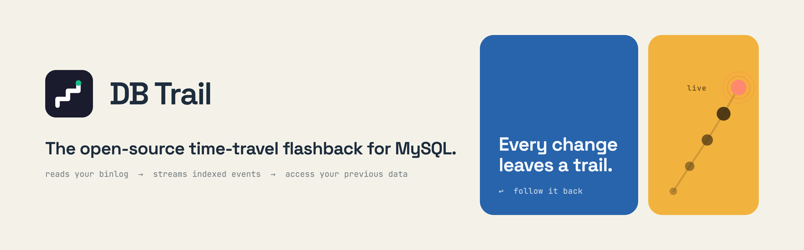
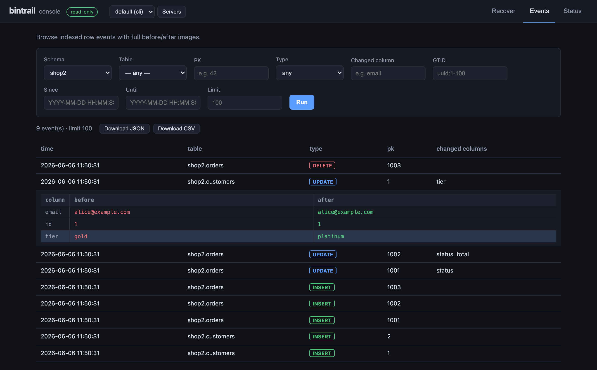
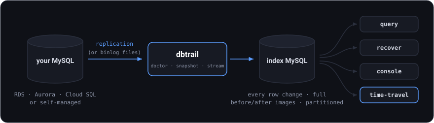

<div align="center">



**Point-in-time recovery for MySQL — no locks, no schema changes, no waiting for a restore.**

[](https://github.com/dbtrail/bintrail/releases/latest)
[](LICENSE)
[](https://github.com/dbtrail/bintrail/actions)

```sql
SELECT * FROM orders WHERE id = 123 AS OF '2026-05-20 14:00:00'
```

*— against production MySQL. That's the experience bintrail makes possible.*



</div>

---

Bintrail tails the binary log, keeps every row change with full
before/after images in a searchable index, and turns "someone ran the wrong
UPDATE" from a restore-from-backup incident into a two-minute fix:

- **See every change** — what changed and when, for every row, with before → after diffs
- **Undo precisely** — generate exact reversal SQL for just the damaged rows
- **Time-travel** — query any row (or table) as it was at any moment
- **From a web console** — browse, recover, and add servers to monitor, all in the UI

It also ships an [MCP server](docs/mcp-server.md), so Claude (or any MCP
client) can search your change history and draft recoveries.

Works with **MySQL**, **Percona Server for MySQL**, **Amazon RDS for
MySQL**, **Amazon Aurora MySQL**, and **Google Cloud SQL for MySQL** —
bintrail connects over the replication protocol, so it never needs access
to the binlog files on disk (that's what makes managed cloud databases
work). Requires MySQL 8.0+ with `binlog_format=ROW` and
`binlog_row_image=FULL` — `bintrail doctor` checks both and prints the
exact fix for anything missing.

## Get started

```sh
curl -fsSLO https://raw.githubusercontent.com/dbtrail/bintrail/main/docker-compose.yml
docker compose up -d
docker compose logs -f bintrail
```

Nothing to configure. The logs end with your console URL:

```
Console is running — open it and add the MySQL servers to watch:

    http://127.0.0.1:8090/?token=ab12cd34…
```

Open it and click **+ Add server**: paste the MySQL you want to watch —
host, user, password — and bintrail runs the preflight checks (failures come
back as fix-this cards), provisions an index for it, and starts streaming.
Watching events within the minute, and the terminal is already behind you.
The console binds to your machine only (`127.0.0.1`) and every request
requires the token from the URL.

> The compose stack ships a pinned **MySQL 8.4** container as the index store.
> That index holds the forensic record — **it is your system of record, so
> back up its volumes** (lose them and you re-index from scratch). bintrail
> **ships** that MySQL but does not **operate** it: disk, backups, and
> upgrades are yours. Prefer your own? Set `INDEX_DSN` in `.env` to a MySQL
> 8.0+ **you** run and remove the bundled index services — bintrail installs only its
> tables there, never operating the server. Either way, what's supported on
> each side is spelled out in [SUPPORT.md](SUPPORT.md); for an index that's
> operated for you, that's [dbtrail](https://dbtrail.com).
>
> **Other ways to install** — plain Docker, `.deb`/`.rpm`, `go install`,
> source builds, and the binary quickstart: see **[docs/install.md](docs/install.md)**.
>
> **Just curious?** One container, zero setup, time-travel SQL in 30 seconds:
> `docker run --rm -p 6033:6033 ghcr.io/dbtrail/bintrail-demo` — see
> [the demo image](docs/demo.md).

## How it works

<div align="center">

</div>

The index is self-contained: recovery never needs the original binlog files,
and old partitions rotate out to Parquet files — on local disk or in any
S3-compatible bucket (S3, MinIO, …); no cloud account needed. Queries read
them transparently either way. Time-travel SQL (`AS OF`) is served by a
MySQL-protocol shim behind ProxySQL — your clients keep speaking plain MySQL.

## Documentation

| Start here | Reference | Operations |
|---|---|---|
| [Install](docs/install.md) | [Query & Recovery](docs/query-and-recovery.md) | [Deployment](docs/deployment.md) · [Capacity](docs/capacity.md) |
| [Quickstart](docs/quickstart.md) | [Web console](docs/console.md) | [Rotation & Status](docs/rotation-and-status.md) |
| [DBA guide](docs/guide.md) | [Time-Travel SQL](docs/time-travel-sql.md) | [Docker](docs/docker.md) |
| [30-second demo](docs/demo.md) | [Streaming](docs/streaming.md) · [101](docs/streaming-101.md) · [Indexing](docs/indexing.md) | [Upload to S3](docs/upload.md) |
| | [MCP server](docs/mcp-server.md) · [MCP gateway](docs/mcp-gateway.md) | [Server identity](docs/server-identity.md) |
| | [Dump & Baseline](docs/dump-and-baseline.md) · [DDL tracking](docs/ddl-tracking.md) | [Parquet debugging](docs/parquet-debugging.md) |

## License

[Apache-2.0](LICENSE) — free for any use, including commercial and production.
Contributions welcome: see [CONTRIBUTING.md](CONTRIBUTING.md) (CLA required,
prompted automatically on your first PR).
